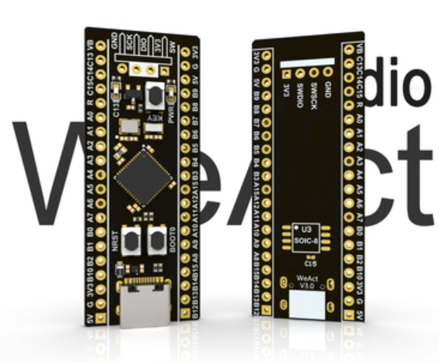

<!--
 * @Author: JunQiLiu
 * @Date: 2021-09-07 12:47:01
 * @LastEditTime: 2021-09-11 15:49:40
 * @Description: 
 * @FilePath: \stm32f401ccu6_rtthread\README.md
 *  
-->
# STM32F401CCU6 rt-thread工程模板

[](https://github.com/JassyL/stm32f401ccu6_rtthread/actions/workflows/scons.yml)
## 简介

本项目为 STM32F401CCU6 核心板的rt-thread工程模板。
## 开发板介绍

开发板外观如下图所示：



该核心板常用 **板载资源** 如下：

- MCU：STM32F401CCU6，主频 84MHz，256KB FLASH ，64KB RAM
- 常用外设
  - LED：2个，D0（红色，电源），D1（绿色，PC13）
  - 按键：1个，K0（PA0）
  - USB
## 外设支持

本 BSP 目前对外设的支持情况如下：

| **板载外设**      | **支持情况** | **备注**                              |
| :----------------- | :----------: | :------------------------------------- |
| USB 转串口        |   支持     |                                       |
| SPI Flash         |   暂不支持     |                                       |
| **片上外设**      | **支持情况** | **备注**                              |
| GPIO              |     支持     | |
| UART              |     支持     | UART1/2                            |
| SPI               |   暂不支持     |                               |
| I2C               |   暂不支持     |                              |
| RTC               |   支持   | 软件RTC                              |
| USB Device        |   暂不支持   | 即将支持                              |
| IWG               |   暂不支持   | 即将支持                              |
| ADC               |   支持   | 通道1\4\5\6\7\8\9\tempraure                              |
| **扩展模块**      | **支持情况** | **备注**                              |
|          |     |                                      |


## 扩展包支持
|**包名称**|**支持情况**|**备注**|
|-|-|-|
|freemodbus|已支持RTU|使用UART2|
|ulog|以支持||
|easyflash|待支持| |


## 运行结果

下载程序成功之后，系统会自动运行。

连接开发板对应串口到 PC , 在终端工具里打开相应的串口（115200-8-1-N），复位设备后，可以看到 RT-Thread 的输出信息:

```bash
 \ | /
- RT -     Thread Operating System
 / | \     4.0.4 build Sep 11 2021
 2006 - 2021 Copyright by rt-thread team
msh >
```
## 进阶使用

此 BSP 默认只开启了 GPIO 和 串口1 的功能，如果需使用更多高级功能，需要利用 ENV 工具对BSP 进行配置，步骤如下：

1. 在 bsp 下打开 env 工具。

2. 输入`menuconfig`命令配置工程，配置好之后保存退出。

3. 输入`pkgs --update`命令更新软件包。

4. 输入`scons --target=mdk4/mdk5/iar` 命令重新生成工程。

本章节更多详细的介绍请参考 [STM32 系列 BSP 外设驱动使用教程](../docs/STM32系列BSP外设驱动使用教程.md)。
